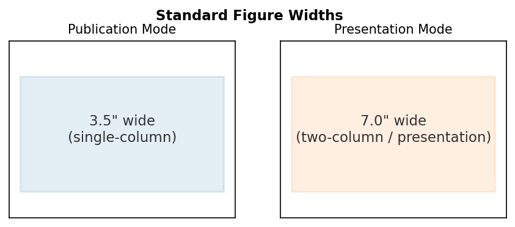
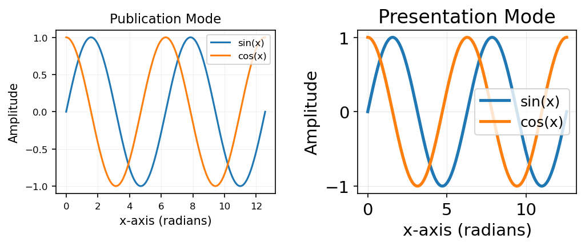
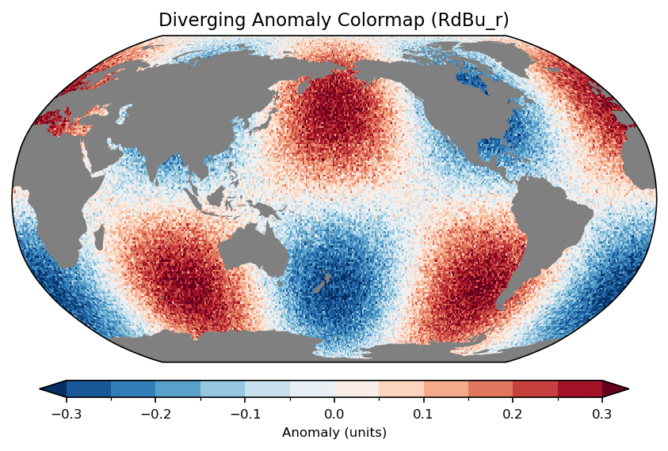
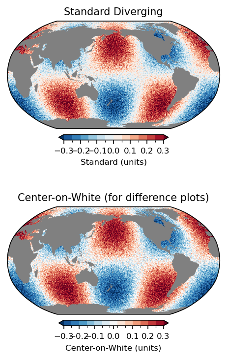
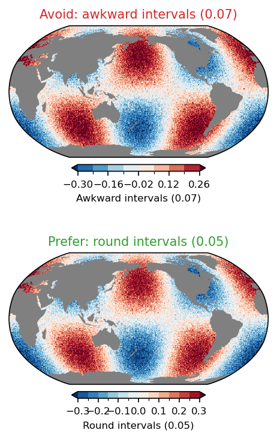
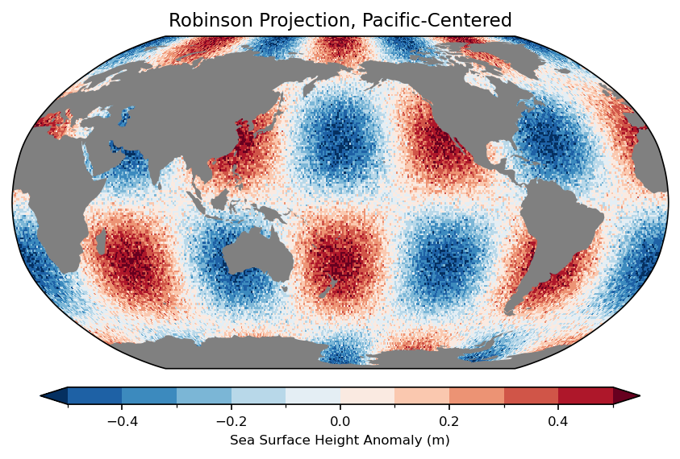
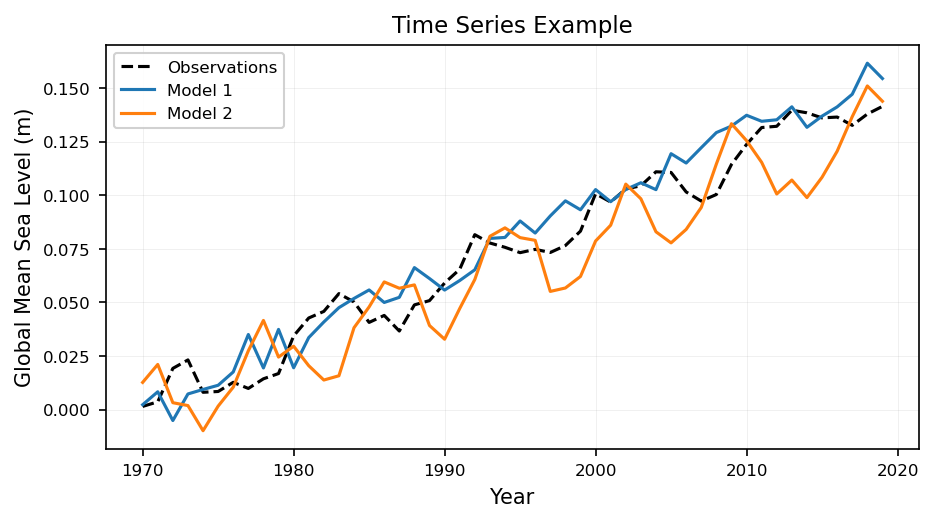
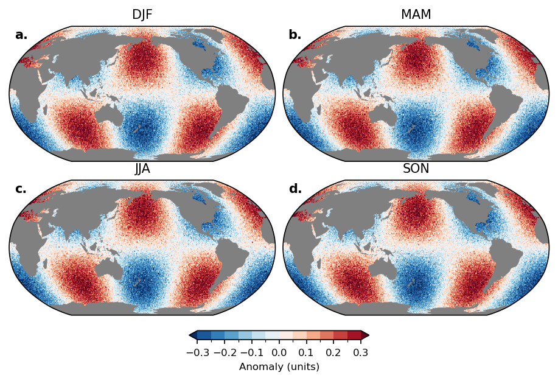
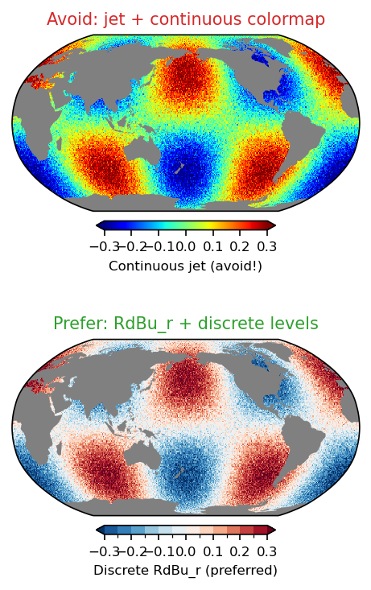

# Plotting Style Guide

A beginner-friendly guide to creating publication-quality climate science figures with `climplot`. Every recommendation here is backed by a single goal: make your figures clear, consistent, and ready for journals or presentations without last-minute rework.

---

## Table of Contents

1. [Getting Started](#getting-started)
2. [Figure Dimensions & Resolution](#figure-dimensions--resolution)
3. [Typography](#typography)
4. [Color Schemes](#color-schemes)
5. [Map Projections](#map-projections)
6. [Colorbars](#colorbars)
7. [Time Series](#time-series)
8. [Multi-Panel Figures](#multi-panel-figures)
9. [Saving Figures](#saving-figures)
10. [Area-Weighted Statistics](#area-weighted-statistics)
11. [Complete Workflow](#complete-workflow)
12. [Common Pitfalls](#common-pitfalls)
13. [Quick Reference](#quick-reference)

---

## Getting Started

Before creating any figure, set the style mode. This one call configures fonts, DPI, line widths, and figure sizes so you don't have to touch `rcParams` manually:

```python
import climplot

# For journal figures (3.5" wide, 300 DPI, small fonts)
climplot.publication()

# -- OR --

# For slides and posters (7.0" wide, 150 DPI, large fonts)
climplot.presentation()
```

Call this **once at the top of your script**, before creating any figures. Everything that follows inherits the right settings.

---

## Figure Dimensions & Resolution

Most journals accept figures at two standard widths. Using these sizes from the start means your figures won't be rescaled (and distorted) during typesetting.

| Mode         | Width   | DPI | Use Case |
|--------------|---------|-----|----------|
| Publication  | 3.5"    | 300 | Single-column journal figures |
| Publication  | 7.0"    | 300 | Two-column journal figures |
| Presentation | 7.0"    | 150 | Slides and posters |

```python
# Single-column (default)
climplot.publication()

# Two-column
climplot.publication(width=7.0)

# Presentation
climplot.presentation()
```

**Why this matters:** A 3.5"-wide figure at 300 DPI is 1050 pixels across — sharp on print without bloated file sizes. Presentation mode uses 150 DPI because projectors and screens can't resolve 300 DPI anyway, and smaller files load faster in slide decks.



---

## Typography

Font sizes are pre-configured by `publication()` and `presentation()` so every label, tick, and title is legible at the target medium.

### Publication Mode

| Element         | Size   |
|-----------------|--------|
| Axis labels     | 10 pt  |
| Tick labels     | 8 pt   |
| Titles          | 11 pt  |
| Legends         | 8 pt   |
| Colorbar labels | 8 pt   |

### Presentation Mode

| Element         | Size   |
|-----------------|--------|
| Axis labels     | 14 pt  |
| Tick labels     | 14 pt  |
| Titles          | 16 pt  |
| Legends         | 12 pt  |
| Colorbar labels | 12 pt  |

**Why this matters:** Journal figures are physically small (3.5"), so fonts must be dense. Slides are viewed from a distance, so fonts must be large. Mixing the two creates figures that are either unreadable in print or laughably oversized on screen.



---

## Color Schemes

### Diverging Colormaps for Anomalies

For any field centered on zero (temperature anomalies, sea level anomalies, biases), use a diverging colormap:

```python
cmap, norm, levels = climplot.anomaly_cmap(vmin=-0.3, vmax=0.3, interval=0.05)
```

This returns three things you'll pass directly to `pcolormesh`:
- `cmap` — the colormap (`RdBu_r` by default: red = positive, blue = negative)
- `norm` — a `BoundaryNorm` that maps data to discrete color bins
- `levels` — the array of level boundaries



### Center-on-White for Difference Plots

When plotting differences (model minus observations), near-zero values are ambiguous — is that "no difference" or "small positive"? The `center_on_white` option adds a white band around zero so near-zero values stand out:

```python
# White band covers ±interval/2 around zero
cmap, norm, levels = climplot.anomaly_cmap(
    -0.3, 0.3, 0.05, center_on_white=True
)
```

**When to use it:** Difference plots, bias maps, change-over-time maps. Don't use it for raw anomaly fields where you want to see the full gradient through zero.



### Sequential Colormaps

For positive-only data (ice concentration, precipitation amount, wind speed):

```python
cmap, norm, levels = climplot.sequential_cmap(vmin=0, vmax=100, interval=10)
```

### Round Intervals

Always pick contour-level intervals that end in **0, 1, 2, or 5**. These are the intervals that produce clean, readable colorbar labels:

| Good intervals | Bad intervals |
|----------------|---------------|
| 0.01, 0.02, 0.05 | 0.03, 0.07, 0.13 |
| 0.1, 0.2, 0.5 | 0.15, 0.3, 0.7 |
| 1, 2, 5, 10 | 3, 7, 15 |

**Why this matters:** Readers scan colorbar ticks quickly. Round numbers are parsed instantly; odd numbers force mental arithmetic.



---

## Map Projections

### Creating a Map

The default is a Robinson projection centered on the Pacific (180°) — a good all-around choice for global climate data:

```python
fig, ax = climplot.map_figure()
```

For an Atlantic-centered view:

```python
fig, ax = climplot.map_figure(central_longitude=0)
```

Other projections are available:

```python
fig, ax = climplot.map_figure(projection='mollweide')    # Equal-area
fig, ax = climplot.map_figure(projection='platecarree')   # Simple lat/lon
fig, ax = climplot.map_figure(projection='orthographic')  # Globe view
```

### Rendering Land

There are **two workflows** for rendering land, and picking the wrong one produces visible coastline artifacts. The choice depends on your grid type:

| Grid type | Workflow | Functions |
|---|---|---|
| Regular / regridded (obs, reanalysis) | Cartopy Natural Earth land | `climplot.add_land_feature()` + `climplot.add_coastlines()` |
| Native ocean-model (tripolar, MOM6) | Gray background + NaN masking | `climplot.plot_ocean_field()` |

#### Regular / regridded grids

Add a filled land feature from Natural Earth. This draws gray continents on top of the data and works well because Cartopy coastlines align with regular-grid data:

```python
fig, ax = climplot.map_figure()
cs = ax.pcolormesh(lon, lat, data, cmap=cmap, norm=norm,
                   transform=ccrs.PlateCarree())
climplot.add_land_feature(ax)      # filled gray continents
climplot.add_coastlines(ax)        # optional coastline outlines
```

#### Native ocean-model grids

Cartopy coastlines **will not align** with the model's land/sea mask, producing ugly artifacts along coastlines. Use `plot_ocean_field()` instead, which bundles three steps:

1. Sets the axis background to gray so NaN values render as land
2. Optionally masks land points using `wet_mask` (1=ocean, 0=land)
3. Plots the data with pcolormesh, contourf, or contour

```python
fig, ax = climplot.map_figure()
cs = climplot.plot_ocean_field(
    ax, geolon_c, geolat_c, sst,
    wet_mask=wet,          # 1=ocean, 0=land
    method="pcolormesh",   # default; also "contourf", "contour"
    cmap=cmap, norm=norm,
)
```

> **Coordinate convention:** `pcolormesh` requires **corner** coordinates (`geolon_c`/`geolat_c`). `contourf` and `contour` require **center** coordinates (`geolon`/`geolat`). Passing the wrong type causes a half-cell shift.

> **Tip:** If you need contourf/contour (which use center coordinates), you can also call `set_land_background(ax)` and `mask_land(data, wet)` manually instead of `plot_ocean_field`.

**Do NOT** add cartopy gridlines to maps — they clutter global projections.



---

## Colorbars

Every colorbar should be:
- **Horizontal** below the plot (for maps)
- **Extended** with `extend='both'` so out-of-range values get arrows
- **Labeled** with units — always

```python
climplot.add_colorbar(cs, ax, 'Sea Level Anomaly (m)')
```

For multi-panel figures sharing the same color scale, use a single colorbar below all panels:

```python
climplot.bottom_colorbar(cs, fig, axes, 'Temperature Anomaly (K)')
```

**Why units matter:** A colorbar without units is ambiguous. Is that 0.3 meters or 0.3 millimeters? Always include the unit in parentheses.

---

## Time Series

Create a time series figure with a built-in grid:

```python
fig, ax = climplot.timeseries_figure()
```

Use consistent colors for observations and models:

```python
# Observations: black, dashed
ax.plot(years, obs, color='#000000', linestyle='--', label='Observations')

# Model runs: solid, distinct colors
ax.plot(years, model1, color='#1f77b4', label='Model 1')  # Blue
ax.plot(years, model2, color='#ff7f0e', label='Model 2')  # Orange
ax.plot(years, model3, color='#2ca02c', label='Model 3')  # Green
```

Always include:
- **x-axis label** (e.g., "Year")
- **y-axis label with units** (e.g., "Global Mean Sea Level (m)")
- **Legend**

```python
ax.set_xlabel('Year')
ax.set_ylabel('Global Mean Sea Level (m)')
ax.legend()
```



---

## Multi-Panel Figures

### Creating Panels

`panel_figure()` creates a grid of subplots with `constrained_layout=True` for proper spacing:

```python
fig, axes = climplot.panel_figure(2, 2)
```

For map panels, pass a projection:

```python
import cartopy.crs as ccrs
fig, axes = climplot.panel_figure(
    2, 2, projection=ccrs.Robinson(central_longitude=180)
)
```

### Panel Labels

Add bold **a.** **b.** **c.** **d.** labels for easy reference in figure captions:

```python
climplot.add_panel_labels(axes.flatten())
```

### Shared Colorbar

When all panels share the same color scale, add one colorbar below:

```python
climplot.bottom_colorbar(cs, fig, axes, 'Anomaly (units)')
```



---

## Saving Figures

### PNG (default)

```python
climplot.save_figure('my_figure.png')
```

This saves to a `figures/` directory (created automatically) with `bbox_inches='tight'`, white background, and the DPI set by your style mode.

To save to a different directory:

```python
climplot.save_figure('my_figure.png', output_dir='results/plots')
```

### PDF

For vector output (e.g., journal submission requiring PDF), enable `for_pdf` when setting the style mode. This embeds fonts as TrueType:

```python
climplot.publication(for_pdf=True)
# ... create your figure ...
climplot.save_figure('my_figure.pdf')
```

---

## Area-Weighted Statistics

When computing spatial statistics over a global field, you **must** account for the fact that grid cells near the poles cover less area than cells at the equator. A simple `data.mean()` will over-weight the poles.

```python
import numpy as np

# Create latitude-based area weights
lat_weights = np.cos(np.deg2rad(lat))

# Correct: area-weighted global mean
global_mean = climplot.area_weighted_mean(data, weights=lat_weights, dim=['lat', 'lon'])

# Correct: area-weighted RMSE between model and observations
rmse = climplot.area_weighted_rmse(model, obs, weights=lat_weights, dim=['lat', 'lon'])

# Correct: pattern correlation
corr = climplot.area_weighted_corr(model, obs, weights=lat_weights, dim=['lat', 'lon'])
```

See the [Metrics documentation](source/metrics.rst) for the full API.

---

## Complete Workflow

Two complete scripts — pick the one that matches your data.

### Example A: Regridded / Observational Data

For data on a regular lat/lon grid (e.g., HadISST, ERA5 regridded):

```python
"""Complete example: regridded data on a regular grid."""
import numpy as np
import cartopy.crs as ccrs
import climplot

# 1. Set style
climplot.publication()

# 2. Create synthetic data (replace with your real data)
lon = np.arange(0.5, 360.5, 1.0)
lat = np.arange(-89.5, 90.5, 1.0)
LON, LAT = np.meshgrid(lon, lat)
data = 0.3 * np.sin(np.radians(LAT) * 2) * np.cos(np.radians(LON) * 2)

# 3. Set up colormap with round intervals
cmap, norm, levels = climplot.anomaly_cmap(vmin=-0.3, vmax=0.3, interval=0.05)

# 4. Create the map
fig, ax = climplot.map_figure(figsize=(7.0, 4.0))

# 5. Plot the data
cs = ax.pcolormesh(
    lon, lat, data,
    cmap=cmap, norm=norm,
    transform=ccrs.PlateCarree(),
)

# 6. Add land and colorbar (with units!)
climplot.add_land_feature(ax)
climplot.add_coastlines(ax)
climplot.add_colorbar(cs, ax, 'Temperature Anomaly (K)')

# 7. Title
ax.set_title('Global Temperature Anomaly')

# 8. Save
climplot.save_figure('temperature_anomaly.png')
```

### Example B: Native Ocean-Model Grid

For data on a tripolar / MOM6 native grid (e.g., reading directly from model output):

```python
"""Complete example: native ocean-model grid with plot_ocean_field."""
import xarray as xr
import climplot

# 1. Set style
climplot.publication()

# 2. Load model data (typical MOM6 file pattern)
ds = xr.open_dataset("ocean_monthly.nc")
sst = ds["tos"].isel(time=0)           # sea surface temperature
wet = ds["wet"]                         # 1=ocean, 0=land

# Corner coordinates for pcolormesh
grid = xr.open_dataset("ocean_static.nc")
geolon_c = grid["geolon_c"]
geolat_c = grid["geolat_c"]

# 3. Set up colormap
cmap, norm, levels = climplot.sequential_cmap(vmin=-2, vmax=32, interval=2)

# 4. Create the map and plot in one call
fig, ax = climplot.map_figure(figsize=(7.0, 4.0))
cs = climplot.plot_ocean_field(
    ax, geolon_c, geolat_c, sst,
    wet_mask=wet,
    cmap=cmap, norm=norm,
)

# 5. Colorbar and title
climplot.add_colorbar(cs, ax, 'SST (°C)')
ax.set_title('Sea Surface Temperature — Native Grid')

# 6. Save
climplot.save_figure('native_grid_sst.png')
```

---

## Common Pitfalls

These are the most frequent mistakes in climate figures. Each one has a simple fix.

### 1. Missing Units

```python
# Wrong
climplot.add_colorbar(cs, ax, 'Temperature')

# Right
climplot.add_colorbar(cs, ax, 'Temperature Anomaly (K)')
```

### 2. Unweighted Spatial Statistics

```python
# Wrong — over-weights polar regions
global_mean = data.mean()

# Right — accounts for grid-cell area
global_mean = climplot.area_weighted_mean(data, weights=lat_weights, dim=['lat', 'lon'])
```

### 3. Asymmetric Anomaly Color Limits

```python
# Wrong — shifts the zero point off-center
cmap, norm, levels = climplot.anomaly_cmap(-0.2, 0.5, 0.05)

# Right — symmetric around zero
cmap, norm, levels = climplot.anomaly_cmap(-0.5, 0.5, 0.05)
```

### 4. Rainbow (jet) Colormap

Rainbow colormaps create artificial boundaries, obscure data structure, and are inaccessible to colorblind readers.

```python
# Wrong
ax.pcolormesh(lon, lat, data, cmap='jet')

# Right
cmap, norm, levels = climplot.anomaly_cmap(-0.3, 0.3, 0.05)
ax.pcolormesh(lon, lat, data, cmap=cmap, norm=norm)
```



### 5. Continuous Colormaps

Continuous color scales make it hard to determine exact values from the colorbar.

```python
# Wrong — continuous
ax.pcolormesh(lon, lat, data, cmap='RdBu_r', vmin=-0.3, vmax=0.3)

# Right — discrete levels
cmap, norm, levels = climplot.anomaly_cmap(-0.3, 0.3, 0.05)
ax.pcolormesh(lon, lat, data, cmap=cmap, norm=norm)
```

### 6. Awkward Intervals

```python
# Wrong — 0.07 is not a round interval
levels = np.arange(-0.3, 0.31, 0.07)

# Right — 0.05 ends in 5
cmap, norm, levels = climplot.anomaly_cmap(-0.3, 0.3, 0.05)
```

### 7. Fonts Too Small

The minimum readable font size is 8 pt. `climplot.publication()` sets the smallest elements (ticks, legends) to exactly 8 pt — don't override these to be smaller.

### 8. Missing `extend='both'`

Without extensions, out-of-range data appears as blank/white, which looks like missing data.

```python
# Wrong — no arrows for out-of-range values
plt.colorbar(cs, ax=ax)

# Right — arrows indicate data beyond the range
climplot.add_colorbar(cs, ax, 'Anomaly (m)')  # extend='both' by default
```

### 9. Gridlines on Maps

Gridlines clutter global maps. Don't add them.

```python
# Wrong
ax.gridlines()

# Right — just don't add gridlines to maps
```

### 10. Saving Without `bbox_inches='tight'`

Without tight bounding, labels get clipped.

```python
# Wrong
plt.savefig('figure.png')

# Right — use save_figure() which handles this automatically
climplot.save_figure('figure.png')
```

### 11. Coastlines on Model Data

Cartopy coastlines won't match model land/ocean masks, creating ugly misalignment.

```python
# Wrong for model native grids
ax.coastlines()

# Right — use plot_ocean_field (recommended)
cs = climplot.plot_ocean_field(ax, geolon_c, geolat_c, data, wet_mask=wet)

# Alternative — add_land_overlay for center-coord pcolormesh already on the axes
climplot.add_land_overlay(ax, geolon, geolat, wet_mask)
```

### 12. No Explicit Land Rendering

Relying on the default background color for land means any change to the figure background breaks the land appearance.

```python
# Wrong — no land rendering
cs = ax.pcolormesh(lon, lat, data, transform=ccrs.PlateCarree())

# Right for regular grids — Cartopy filled continents
climplot.add_land_feature(ax)

# Right for native model grids — use plot_ocean_field (handles land automatically)
cs = climplot.plot_ocean_field(ax, geolon_c, geolat_c, data, wet_mask=wet)
```

---

## Quick Reference

### Land-Rendering Decision

| Grid type | Workflow | Functions |
|---|---|---|
| **Native ocean-model** (tripolar, MOM6) | Gray background + NaN masking | `climplot.plot_ocean_field()` |
| **Regular / regridded** (obs, reanalysis) | Cartopy Natural Earth land | `climplot.add_land_feature()` + `climplot.add_coastlines()` |

### Function Reference

| Function | Description |
|----------|-------------|
| `climplot.publication()` | Set publication mode (3.5", 300 DPI, small fonts) |
| `climplot.presentation()` | Set presentation mode (7.0", 150 DPI, large fonts) |
| `climplot.reset_style()` | Reset to matplotlib defaults |
| `climplot.anomaly_cmap(vmin, vmax, interval)` | Diverging colormap for anomalies |
| `climplot.sequential_cmap(vmin, vmax, interval)` | Sequential colormap for positive data |
| `climplot.discrete_cmap(vmin, vmax, interval)` | General discrete colormap |
| `climplot.map_figure()` | Create map with Cartopy projection |
| `climplot.plot_ocean_field(ax, lon, lat, data)` | Plot ocean field on native model grid (bundles background + mask + plot) |
| `climplot.set_land_background(ax)` | Set axis background to gray for NaN-as-land rendering |
| `climplot.mask_land(data, wet_mask)` | Mask land points to NaN using wet_mask (1=ocean, 0=land) |
| `climplot.add_land_feature(ax)` | Add filled gray continents from Natural Earth (regular grids) |
| `climplot.add_coastlines(ax)` | Add coastline outlines (regular grids) |
| `climplot.add_land_overlay(ax, lon, lat, wet_mask)` | Legacy gray overlay using center-coord pcolormesh |
| `climplot.timeseries_figure()` | Create time series figure with grid |
| `climplot.panel_figure(nrows, ncols)` | Create multi-panel figure |
| `climplot.add_panel_labels(axes)` | Add bold a. b. c. d. labels |
| `climplot.add_colorbar(cs, ax, label)` | Add horizontal colorbar with units |
| `climplot.bottom_colorbar(cs, fig, axes, label)` | Shared colorbar below all panels |
| `climplot.save_figure(filename)` | Save with tight bbox and white background |
| `climplot.area_weighted_mean(data, weights, dim)` | Area-weighted spatial mean |
| `climplot.area_weighted_rmse(model, obs, weights, dim)` | Area-weighted RMSE |
| `climplot.area_weighted_corr(x, y, weights, dim)` | Area-weighted pattern correlation |
